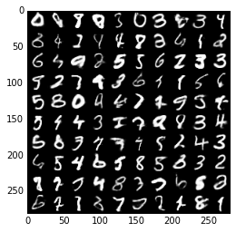
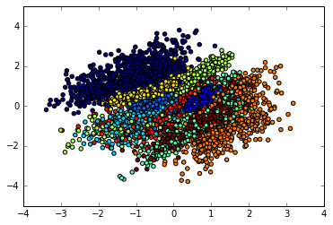

# Implementation of MMD Variational Autoencoder

Details and motivation are described in this [paper](https://arxiv.org/abs/1706.02262) or [tutorial](http://127.0.0.1:4000/2017/06/07/a-tutorial-on-mmd-variational-autoencoders.html)

This implementation trains on MNIST, generating reasonable quality samples after less than one minute of training on a single Titan X

When latent dimensionality is 2, we can also visualize the distribution of labels in the feature space. 

